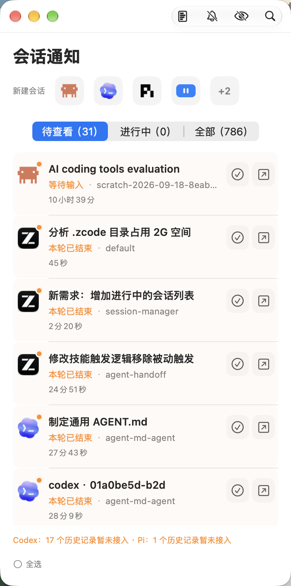
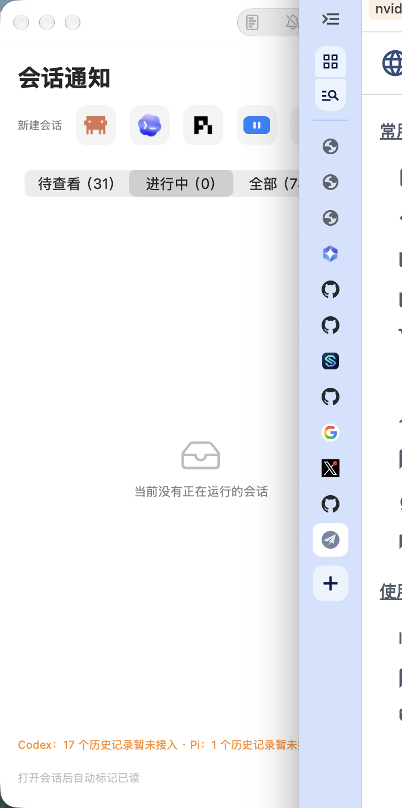
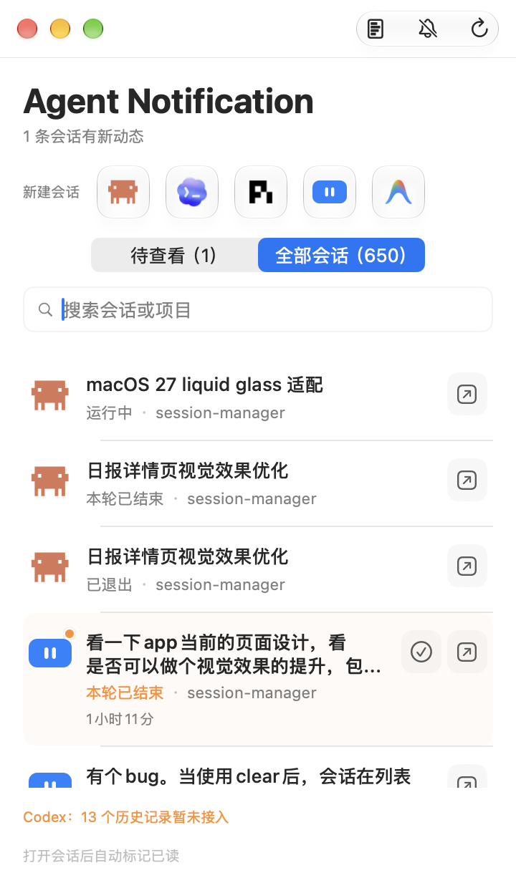
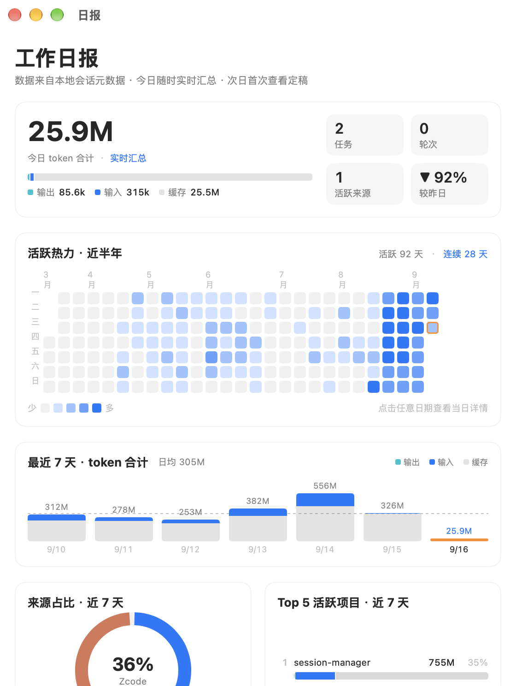
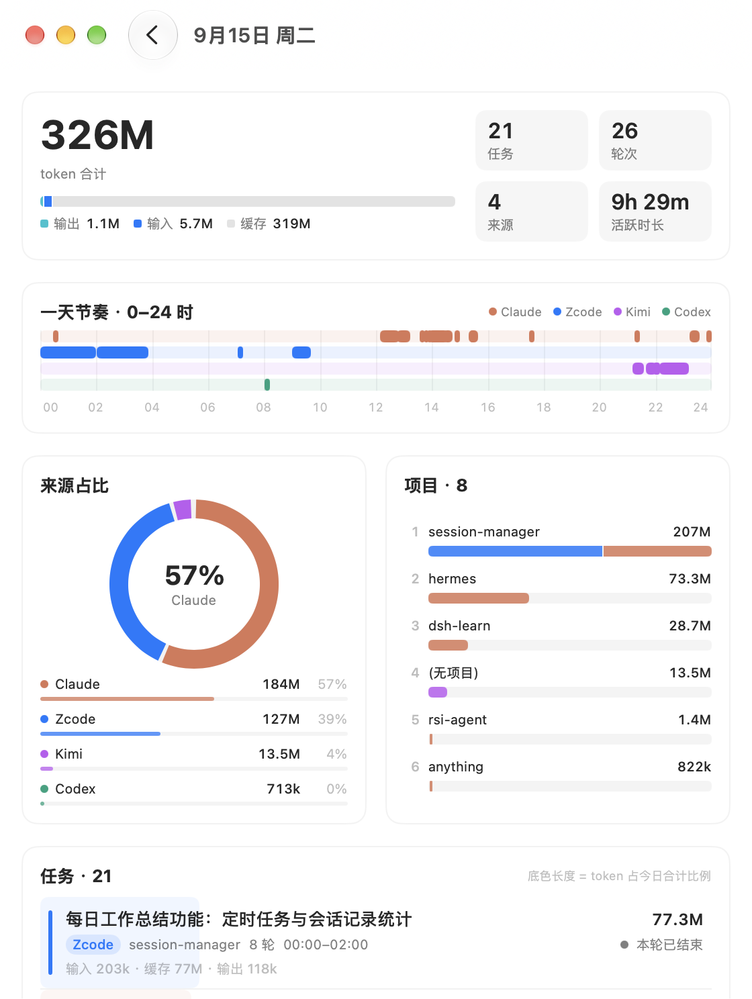

# Agent Notification

[English](README.md) | 简体中文

Agent Notification 是运行于 macOS 的本地会话收件箱：汇总 Codex、Claude Code、Zcode 桌面会话与 iTerm2 中受管理的 Pi、Kimi CLI 会话，将需要人工介入的状态集中呈现，并提供定位回原会话的入口。

## 界面预览

| 待查看 | 进行中 | 全部 | 工作日报 | 当日详情 |
|---|---|---|---|---|
|  |  |  |  |  |

## 项目组成

| 组件 | 说明 |
|---|---|
| `bin/session-manager` | 统一命令行入口：受管理启动、绑定查询、会话聚焦、收件箱维护 |
| Agent Notification（`build/Agent Notification.app`，界面显示名「会话通知」） | 原生 macOS 应用：待处理/进行中列表、系统通知、菜单栏与 Dock 角标计数、CLI 快捷启动 |
| `build/zcode-focus` | Zcode 原生导航辅助工具（由 `native/ZcodeFocus.swift` 编译） |

核心能力：

- 聚合七类来源（Claude、Codex、Zcode、Pi、Kimi、OpenCode、Antigravity）的会话状态（运行中、等待输入、本轮已结束、发生错误、已中断、已退出），按最近活动排序，懒加载分页。
- 「进行中」分段实时列出正在等待模型回复的回合（运行中态；等待用户确认权限或开着空闲不算），回合结束自动离场，3 秒轮询免刷新。
- 其它工具（多 agent 协作等）拉起的会话默认过滤：不通知、不进待查看、不计入日报合计；工具栏可开关查看审计，日报注脚披露其 token 消耗。判定采用声明优于推断：工具拉起时设置 `SESSION_MANAGER_ORIGIN=agent|user` 即精确声明（最高优先级），未声明走各来源启发式；行内右键可手动改判并沉淀为目录规则。
- 工作日报：按 token 消耗（输入/缓存/输出三类）统计每天会话任务，GitHub 式热力图回看近半年，附近 7 天来源/模型/项目榜（含按 API 标价估算的 USD 金额，只展示美元）；日/周/月同一设计语言；当天实时计算，过去日在查看时定稿固化。
- 桌面组件：会话通知、用量金额、最近任务三类，官方来源图标 + 品牌色；金额统一 USD 伴随展示，用量组件可配周期与视角（托盘菜单「组件默认设置…」）；CI 构建为配置式组件，本机 CLT 构建为降级静态组件。
- Pi/Kimi 经受管理启动器运行，登记 run_id 与 session_id 绑定；跳转前复核运行锁、会话 ID 与前台进程组，进程退出后旧绑定一律拒绝。
- Zcode 通过辅助功能接口打开任务搜索并预填标题，停在结果页，由使用者自行选择目标。
- 从应用成功打开会话后自动标记已处理（携带 revision 校验，不吞并打开期间到达的新事件）；打开失败保留未读。待查看列表可勾选任意子集后批量标记已读（含「全选」），逐项按 revision 校验，确认瞬间已有新活动的项保留未读。
- 仅保存管理所需元数据（会话标识、标题摘要、项目、状态、时间与定位信息），不保存对话正文、输入内容或凭据。

## 来源与定位方式

| 来源 | 状态采集 | 打开方式 |
|---|---|---|
| Claude Desktop | 本地元数据与观察 hooks | 已验证的 `claude://` 链接 |
| Codex Desktop | rollout 文件增量读取 | `codex://` 链接 |
| Zcode | 任务索引与运行数据库 | 辅助功能接口打开任务搜索 |
| Pi / Kimi | 受管理启动的扩展事件与生命周期 hooks | 绑定校验通过后聚焦 iTerm2 标签页 |

## 环境要求

- Apple Silicon Mac，macOS 14 或更高版本。
- Python 3.11 及以上（在 3.12 验证）。
- Xcode Command Line Tools。
- iTerm2：Pi/Kimi 受管理会话与聚焦跳转的宿主终端。
- 系统权限：iTerm2 自动化授权首次启动时弹出；Zcode 辅助功能授权用拖拽方式添加（见「快速上手」）。

## 快速上手

已打包版本从 [Releases](../../releases) 下载 Agent-Notification.dmg（双击拖入「应用程序」即装）；从源码构建则克隆仓库后，在项目根目录执行：

```sh
python3 -m venv scratch/iterm-probe-venv
scratch/iterm-probe-venv/bin/python -m pip install -r requirements.txt
mkdir -p build
xcrun swiftc native/ZcodeFocus.swift -o build/zcode-focus
python3 scripts/build_inbox_app.py
```

说明：

- 虚拟环境固定位于 `scratch/iterm-probe-venv`：`bin/session-manager` 按该路径定位 Python 解释器，请勿更改位置。
- `scratch/` 与 `build/` 不纳入版本控制，由上述步骤生成。虚拟环境是开发包 App 的运行时依赖而非一次性产物，清理 `scratch/`（含 `git clean`）时必须保留 `scratch/iterm-probe-venv`：被删后应用页面报 “The file ‘python’ doesn’t exist.”、CLI 报 “Missing runtime”，重跑上面两条 venv 命令即恢复（数据在 `~/.local/state/session-manager`，不受影响）。
- 构建脚本拒绝覆盖正在运行的应用，重建前请先退出「会话通知」。
- 构建产物使用本地 ad-hoc 签名并通过 bundle 校验，不是分发公证；重新构建后如遇权限失效，需在系统设置中重新授权。
- 应用图标有两套来源：`native/GenerateAppIcon.swift` 生成 icns（所有系统可用）；`native/AppIcon.icon` 是 macOS 26+ 的 Liquid Glass 分层图标，构建脚本在检测到 Xcode 26 的 `actool` 时把它编成 `Assets.car`，只有命令行工具时跳过并回退 icns。Release 由 CI（macos-26）构建，因此带分层图标。
- 以上是开发包：应用运行仓库内的脚本和 venv，改脚本无需重建。Release 里的 dmg 由 `python3 scripts/build_inbox_app.py --standalone` 构建，脚本、`bin/session-manager`、`zcode-focus` 和纯 Python 依赖（`requirements-standalone.txt`）随包放在 `Contents/Resources`，不依赖仓库；运行需要本机有 python3 3.11+（Homebrew 安装即可；macOS 系统自带的 3.9 不满足，2026-09-21 起最低版本升到 3.11）。两种包用同一套代码，按 `Resources/pylib` 是否存在自动切换。

初始化观察 hooks 并启动应用：

```sh
bin/session-manager inbox setup   # 安装 Claude/Kimi 观察 hooks，保留既有配置，可重复执行
bin/session-manager app           # 打开「会话通知」
bin/session-manager permissions   # 打开辅助功能授权面板，把应用拖进列表
```

授权采用拖拽方式：点击 Zcode 事项的「前往会话」时若缺辅助功能权限，应用会自动打开「隐私与安全性 → 辅助功能」面板，并弹出一个可拖拽的应用悬浮窗，把它拖进列表即完成授权，授权后悬浮窗自动收起；`bin/session-manager permissions` 是等效的手动入口（Finder 显示应用 + 打开面板）。应用为 ad-hoc 签名，每次重建后需要重新拖入；列表里旧条目开关显示开启不代表新版已获授权。

应用启动时检测本机安装的 CLI（claude、codex、pi、kimi、agy、opencode），在「新建会话」行平铺已安装项一键目录启动（iTerm2 新标签），放不下时行尾「+N」菜单收纳其余项；pi/kimi/opencode/agy 为受管理启动（经 `bin/session-manager` 注册绑定，opencode/agy 的事件通道分别由 OPENCODE_CONFIG 注入插件与 setup-agy 安装插件提供，不改各家全局配置），跳转经运行锁+前台进程组校验后聚焦原标签；agy 无失败/等待类事件（官方 hooks 仅五种），其余状态齐全。工作日报计入 OpenCode token（受管理口径：仅统计经受管理入口启动的会话）。能力边界见 docs/specs/unified-inbox.md 与 cli-session-binding.md。首次从应用启动 CLI 会请求「会话通知 控制 iTerm2」授权。

## 命令行参考

| 命令 | 用途 |
|---|---|
| `bin/session-manager pi` \| `kimi` | 受管理启动 Pi/Kimi 会话，自动登记绑定 |
| `bin/session-manager list` | 查看当前会话绑定 |
| `bin/session-manager focus RUN_ID SESSION_ID` | 校验绑定并聚焦原 iTerm2 标签页 |
| `bin/session-manager zcode-focus TASK_ID` | 打开指定 Zcode 任务；`--describe` 仅解析任务元数据 |
| `bin/session-manager inbox setup` | 安装或更新观察 hooks（幂等，不覆盖既有配置） |
| `bin/session-manager inbox rows \| sync \| open \| ack \| ack-batch` | 收件箱数据查询与维护 |
| `bin/session-manager inbox daily-report [--date YYYY-MM-DD] \| --overview` | 生成单日报告或热力图总览（自动补录缺失日期）；响应附按标价估算的 cost |
| `bin/session-manager inbox usage --period day\|week\|month\|all [--json]` | 跨周期用量与金额（ISO 周 / 自然月，日/周/月三视图） |
| `bin/session-manager inbox pricing show \| check \| update \| fx` | 价格表查询、缺口检查、自动拉取与手动汇率 |
| `bin/session-manager app` | 打开「会话通知」 |

诊断脚本：

- `python3 scripts/probe_capabilities.py`：检查安装包静态能力，不修改 agent 配置。
- `python3 scripts/claude_locator.py <session-id>`：只读解析已有 Claude Desktop 会话链接；失败或歧义时明确报错，不猜测最近会话。
- `python3 scripts/capture_hook.py <provider> --output-dir <dir>`：从 stdin 接收诊断事件，仅保存会话 ID、事件类型及可选 turn ID，不自动安装 hooks。

运行测试：

```sh
python3 -W error::ResourceWarning -m unittest discover -s tests -v
```

## 已知边界

- 仅支持 Apple Silicon 与 macOS 14+；Pi/Kimi 仅支持 iTerm2 作为宿主终端。
- 「本轮已结束」表示回合状态，不代表业务目标成功。
- Zcode 的「等待权限批准」仅存在于桌面应用内存，无法与「运行中」区分，统一显示运行中；这是数据源边界。
- 跨来源首次导入以监控开始时间为基线，历史完成记录不会批量变成待处理。
- 本项目是协作式会话管理工具，不提供针对恶意本机进程的安全隔离。

## 文档

| 文档 | 类别 | 说明 |
|---|---|---|
| [统一收件箱](docs/specs/unified-inbox.md) | 规范 | 使用入口、数据来源、状态语义与已知边界 |
| [工作日报](docs/specs/daily-report.md) | 规范 | token 统计口径、逐 model 用量（schema v8）、固化与补录语义 |
| [CLI 会话绑定](docs/specs/cli-session-binding.md) | 规范 | 受管理启动、存活锁、会话 ID 与前台进程组校验 |
| [Zcode 原生导航](docs/specs/zcode-native-navigation.md) | 规范 | task ID 查标题、AX 搜索、复制任务路径校验 |
| [用量金额与跨周期统计](docs/specs/usage-cost.md) | 规范 | 按 model 计价、价格表三层与自适应拉取、USD/CNY、日/周/月（CLI 与日报金额已实施，界面与组件见执行计划） |
| [桌面组件](docs/specs/desktop-widgets.md) | 已实施（本机降级形态） | 快照、刷新、三类组件、URL 跳转与构建要求 |
| [会话收件箱方案](docs/plans/session-inbox.md) | 设计方案 | 五路接入、通知抓取评估与实现路径 |
| [系统 Terminal 备选](docs/plans/terminal-migration.md) | 设计方案 | 无额外依赖的备用终端探针（暂缓） |
| [用量金额与桌面组件执行计划](docs/plans/usage-cost-widgets-execution.md) | 设计方案 | 工作包、里程碑评审关口与交付要求 |
| [可验证交付 harness](docs/specs/delivery-harness.md) | 规范 | bin/verify、修复证据、风险等级、三层护栏、一次性设置与验证状态 |
| [任务模板](docs/templates/task.md)、[计划模板](docs/templates/plan.md) | 模板 | 把任务写成可验证问题：终态、非目标、编号验收、风险、预算、升级包 |
| [评审清单](docs/templates/review-checklist.md)、[评审提示词](docs/templates/review-prompt.md) | 模板 | 由失败分类生成的评审清单与评审方工作方式，配合 `harness/review_pack.py` 证据包 |
| [试跑任务 001：补 DR14 测试](docs/plans/trial-001-dr14.md) | 设计方案 | 可验证交付首个真实任务试跑：任务说明、预算与试跑记录表 |
| [可验证交付方案](docs/plans/verifiable-delivery.md) | 设计方案 | 以本项目为标杆的全链路 harness：可验证定义、角色、风险等级、护栏分层与 P0–P6 阶段 |
| [日报与桌面组件重设计](docs/plans/2026-09-24-report-widget-redesign.md) | 设计决策记录 | 口径决定（金额伴随/USD-only/官方图标）、实施与已知边界 |
| [日报金额与跨周期统计](docs/plans/usage-cost-report.md) | 设计方案 | 已定稿为规范，保留调研与取舍背景 |
| [桌面组件](docs/plans/desktop-widgets.md) | 设计方案 | 已定稿为规范，保留设计背景与签名探针结论 |
| [本机接入验证](docs/research/2026-09-13-integration-probe.md) | 调研记录 | 运行时证据、可复现检查与联调缺口 |
| [剩余接入排查](docs/research/2026-09-14-integration-findings.md) | 调研记录 | Pi/Kimi 运行时与 Codex/Zcode 兼容读取 |
| [跨终端误判修复](docs/research/2026-09-14-cross-terminal-ownership.md) | 调研记录 | managed focus 误判的原因与回归 |
| [Zcode 待处理遗漏修复](docs/research/2026-09-14-zcode-inbox-fix.md) | 调研记录 | 未读标记与独立待处理状态的界定 |
| [Zcode 状态语义排查](docs/research/2026-09-14-zcode-state-semantics.md) | 调研记录 | 等待权限状态的可达性边界 |
| [Codex 受管理可行性论证](docs/research/2026-09-16-codex-managed-feasibility.md) | 调研记录 | notify/插件/rollout 三通道实测与暂缓决策 |
| [各来源推送通道盘点](docs/research/2026-09-20-push-channels-per-source.md) | 调研记录 | 七家消息通道现状；codex hooks.json 全生命周期实测（含信任门禁）与 zcode 文件事件方案 |
| [harness 评审交接](docs/review/2026-09-25-harness-review-brief.md) | 评审记录 | 交给独立评审方的范围、阅读顺序、复现命令、重点质疑与产出要求 |
| [可验证交付基线](docs/review/2026-09-25-harness-baseline.md) | 评审记录 | v0.8.0 失败分类（R1–R19 与过程失败）、基线指标、Agent 就绪度与可验证性地图 |
| [项目整体评估](docs/review/2026-09-21-project-assessment.md) | 评审记录 | v0.7.4 全库复评、七项缺陷与验证边界；附 v0.7.3 历史评估 |
| [桌面组件签名探针](docs/research/2026-09-23-widget-adhoc-probe.md) | 调研记录 | ad-hoc 签名组件可行性实测、构建要点与未覆盖系统 |
| [市场调研](docs/research/2026-09-13-market-survey.md) | 调研记录 | 现成工具比较与选型依据 |

调研记录为带日期的历史档案，反映当时状态；现行行为以规范文档为准。

## 文档归档约定

后续文档沿用下列约定，优先更新现有主题，避免在根目录散放报告。

| 目录 | 内容 | 命名 |
|---|---|---|
| `docs/research/` | 市场调研、接口调查、实验结论与来源 | `YYYY-MM-DD-topic.md`，注明调研日期与证据边界 |
| `docs/review/` | 全项目、版本或专项代码评审及验证结论 | `YYYY-MM-DD-topic.md`，注明审查基线、证据和未覆盖范围 |
| `docs/plans/` | 设计方案、取舍、未决项和实施路径 | `topic.md`，注明当前阶段，持续更新 |
| `docs/specs/` | 经确认、足以执行的需求和接口规格 | `topic.md`，关联来源方案与验收项 |
| `docs/templates/` | 任务、计划等可复用模板 | `topic.md`，改动随 harness 规范同步 |
| `docs/decisions/` | 已采纳的重要架构决策及理由 | `NNNN-topic.md`，注明状态和被替代关系 |

一次性实验输出放 `scratch/`，有长期价值的证据整理后归入对应文档。新增、迁移或替代文档时同步更新本索引及相关链接；历史文档保留背景，以索引标明的现行规范为准。

## License

[MIT](LICENSE)
